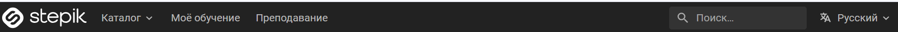
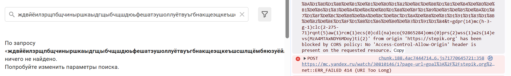

# Список баг-репортов для [Stepik](https://stepik.org/catalog)

Содержит чек-листы, разбитые по модулям, для проверки веб-приложения Stepik в двух браузерах:
- Chrome версия: 144.0.7559.133 (официальная сборка) (64 бит)
- Microsoft Edge версия 144.0.3719.104 (Официальная сборка) (64-разрядная версия)

## Содержание
- [1. Баг-репорты главной страницы](#баг-репорты-главной-страницы)
- [2. Баг-репорты профиля](#баг-репорты-главной-страницы)

## Баг-репорты главной страницы
**Название веб-приложения**: Stepik

**Окружение**: 
- Chrome версия: 144.0.7559.133 (официальная сборка) (64 бит)
- Microsoft Edge версия 144.0.3719.104 (Официальная сборка) (64-разрядная версия)

**Дата тестирования**: 09.02.2026

**Имя тестировщика**: FantasmaDux

<h3 style="display: inline;" id="BUG1">1. Неполная локализация заголовков и элементов форм страницы</h3>

**Идентификатор**: BUG1

**Проект**: Тестирование веб-приложения [Stepik](https://stepik.org/catalog)

**Теги**: Главная страница, Header

**Название**: Неполная локализация заголовков и элементов форм в шапке и основной части страницы 

**Срочность**: низкая

**Важность**: низкая

**Шаги воспроизведения**: 

1. Выбрать в выпадающем списке языков китайский
2. Выбрать в выпадающем списке языков русский
2. Выбрать в выпадающем списке языков английский

**Ожидаемый результат**: 
Каждый выбранный язык будет переводить одни и те же заголовки в шапке

**Фактический результат**: 
Каждый выбранный язык переводит разные части текста. Русский, английский переводят надписи полностью. Китайский не переводит заголовки.

**Приложение**:

  
   
  
   
  

## Баг-репорты профиля

**Название веб-приложения**: Stepik

**Окружение**: 
- Chrome версия: 144.0.7559.133 (официальная сборка) (64 бит)
- Microsoft Edge версия 144.0.3719.104 (Официальная сборка) (64-разрядная версия)

**Дата тестирования**: 09.02.2026

**Имя тестировщика**: FantasmaDux

<h3 style="display: inline;" id="BUG2">1. Поле "биография" наслаивается на другое поле</h3>

**Идентификатор**: BUG2

**Проект**: Тестирование веб-приложения [Stepik](https://stepik.org/catalog)

**Теги**: Страница профиля, Body

**Название**: Поле "биография" ("profile_text") наслаивается на поле "light-tabs__content light-tabs__content_with_border activity-graph-wrapper"

**Срочность**: низкая

**Важность**: низкая

**Шаги воспроизведения**: 

1. Зайти в "настройки" > "редактировать профиль"
2. Ввести в текстовое поле "краткая биография" последовательность из 255 символов
2.1. Тестовые данные: "тзяызйкллэёеюцаэмъйэкрёяжъюзъаэеейлмёютээпсмйлэюцчирнкллрзнибщтчхтъёрущьуузхюдшбядгзшбсшрюиоясщщневшраёэйъьгдехцыянаъсхчотйэмеяьудчкмплъвсыпшиёввуяызкчпсажнёрщушянвёупнихсжувигшрддишоюэчьшжлюяцшыюякацэжтьзаёмрвоюзлаажъыхяфхгшлшлдгоигюццеыпсэсъосвъгнлотйлж"
3. Сохранить изменения
4. Перейти на страницу профиля

**Ожидаемый результат**: 
Краткая биография не затрагивает другие элементы. Scrollbar по горизонтали не появляется.

**Фактический результат**: 
- Поле "биография" ("profile_text") наслаивается на поле "light-tabs__content light-tabs__content_with_border activity-graph-wrapper".
- Появляется scrollbar по горизонтали.

**Приложение**:

  
   

## Баг-репорты поисковой системы

**Название веб-приложения**: Stepik

**Окружение**: 
- Chrome версия: 144.0.7559.133 (официальная сборка) (64 бит)
- Microsoft Edge версия 144.0.3719.104 (Официальная сборка) (64-разрядная версия)

**Дата тестирования**: 15.02.2026

**Имя тестировщика**: FantasmaDux

<h3 style="display: inline;" id="BUG3">1. Множественные ошибки в консоли DevTools при отправке длинного запроса</h3>

**Идентификатор**: BUG3

**Проект**: Тестирование веб-приложения [Stepik](https://stepik.org/catalog)

**Теги**: Поисковая система, Интеграция с аналитикой, Яндекс.Метрика

**Название**: Ввод очень длинного поискового запроса (>2000 символов) приводит к повторяющимся в консоли DevTools ошибкам отправки данных в Яндекс.Метрику (414 URI Too Long и CORS)

**Срочность**: средняя

**Важность**: низкая

**Шаги воспроизведения**: 

1. Открыть https://stepik.org/catalog
2. Ввести в строку поиска 10000 случайных символов 
3. Нажать Enter или дождаться поиска
4. Открыть консоль разработчика (F12) > вкладка Console

**Ожидаемый результат**: 
Длинные запросы должны обрезаться или не отправляться в аналитику Яндекс.Метрика. Ошибок в консоли нет.

**Фактический результат**: 
Возникают две ошибки, повторяющиеся в консоли бесконечно.
- https://mc.yandex.ru/clmap/30810146?page-url=https%3A%2F%2Fstepik.org%2Fcatalog%2Fsearch%3Fq%3D%2net::ERR_FAILED 414 (URI Too Long)
- Access to XMLHttpRequest from origin 'https://stepik.org' has been blocked by CORS policy: No 'Access-Control-Allow-Origin' header is present on the requested resource.

**Приложение**:

  
   

