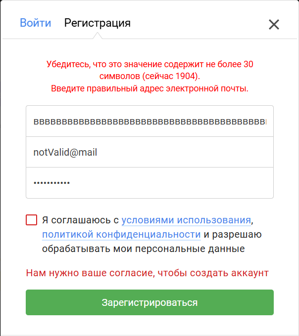
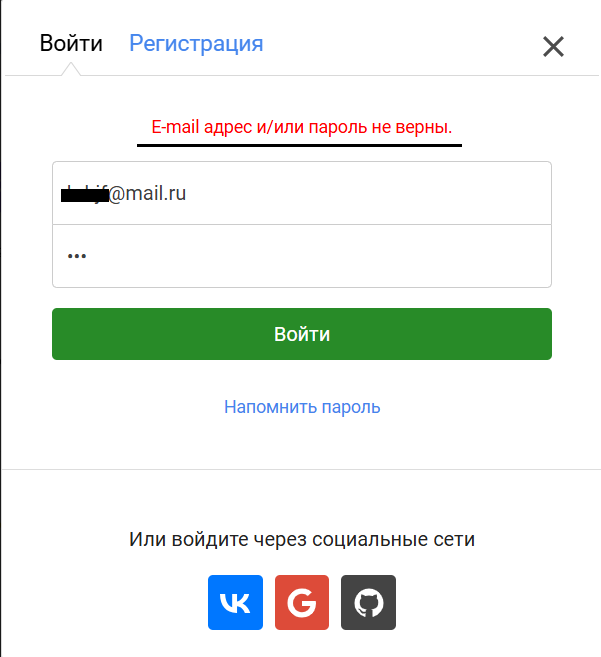
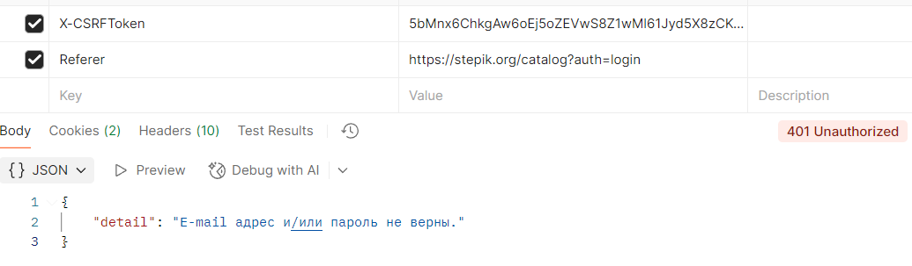
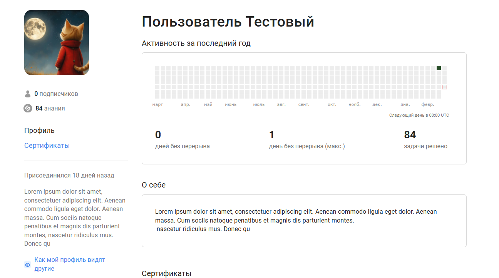
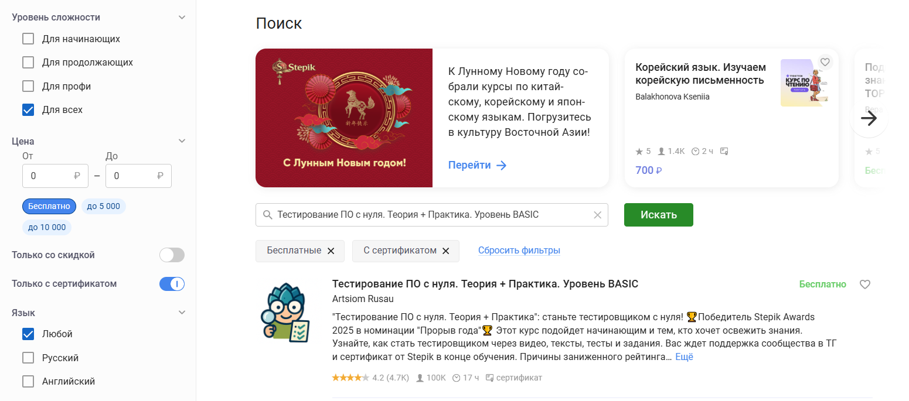

# Список тест-кейсов для [Stepik](https://stepik.org/catalog)

Содержит тест-кейсы для проверки веб-приложения Stepik в двух браузерах:
- Chrome версия: 144.0.7559.133 (официальная сборка) (64 бит)
- Microsoft Edge версия 144.0.3719.104 (Официальная сборка) (64-разрядная версия)

## Содержание
- [1. Тест-кейсы регистрации](#тест-кейсы-регистрации)
- [2. Тест-кейсы логина](#тест-кейсы-логина)
- [3. Тест-кейсы главной страницы](#тест-кейсы-главной-страницы)
- [4. Тест-кейсы профиля](#тест-кейсы-профиля)
- [5. Тест-кейсы поисковой системы](#тест-кейсы-поисковой-системы)

## Тест-кейсы регистрации

<details><summary><h3 style="display: inline; ">1. Тест-кейс регистрации по валидной почте </h3></summary>

**Идентификатор**: TCP1

**Приоритет**: высокий

**Название**: регистрация пользователя по почте с корректными данными

**Предусловия**:

Номер шага | Шаг | Ожидаемый результат| 
|-------------|-------------|----------------------------|
| 1 | Выбрать вариант "зарегистрироваться"  | Открылась форма для регистрации |
| 2 | Ввести валидную почту и валидные данные  | Аккаунт зарегистрирован |

**Приложение**: -
</details>

<details><summary><h3 style="display: inline; ">2. Тест-кейс регистрации по невалидной почте</h3></summary>

**Идентификатор**: TCN1

**Приоритет**: высокий

**Название**: регистрация пользователя по невалидной почте с невалидными данными

**Предусловия**:

Номер шага | Шаг | Ожидаемый результат| 
|-------------|-------------|----------------------------|
| 1 | Выбрать вариант "зарегистрироваться"  | Открылась форма для регистрации |
| 2 | Ввести невалидную почту и невалидные данные  | Получены предупреждения о невалидных данных |

**Приложение**:
<p align="center">
  
</p>
</details>

<details><summary><h3 style="display: inline; ">3. Тест-кейс регистрации по уже зарегистрированной почте</h3></summary>

**Идентификатор**: TCN2

**Приоритет**: высокий

**Название**: регистрация пользователя по уже зарегистрированной почте

**Предусловия**:
Пользователь с такой почтой зарегистрирован на сайте

Номер шага | Шаг | Ожидаемый результат| 
|-------------|-------------|----------------------------|
| 1 | Выбрать вариант "зарегистрироваться" | Открылась форма для регистрации |
| 2 | Ввести зарегистрированную почту | Получено предупреждение, что пользователь уже существует |

**Приложение**: -

</details>


## Тест-кейсы логина

<details><summary><h3 style="display: inline; "> 1. Тест-кейс логина по валидной почте с валидным паролем</h3></summary>

**Идентификатор**: TCP2

**Приоритет**: высокий

**Название**: логин существующего пользователя по почте с валидным паролем

**Предусловия**:
Пользователь с такой почтой зарегистрирован на сайте

Номер шага | Шаг | Ожидаемый результат| 
|-------------|-------------|----------------------------|
| 1 | Выбрать вариант "войти"  | Открылась форма для входа |
| 2 | Ввести валидную почту и валидный пароль  | Выполнен вход под пользователем с указанной почтой |

**Приложение**: -
</details>


<details><summary><h3 style="display: inline; "> 2. Тест-кейс логина по валидной почте с невалидным паролем</h3></summary>

**Идентификатор**: TCN3

**Приоритет**: высокий

**Название**: логин существующего пользователя по почте с невалидным паролем

**Предусловия**:
Пользователь с таким email зарегистрирован на сайте

Номер шага | Шаг | Ожидаемый результат| 
|-------------|-------------|----------------------------|
| 1 | Выбрать вариант "войти"  | Открылась форма для входа |
| 2 | Ввести валидную почту и невалидный пароль  | Получена ошибка о невалидных данных |

**Приложение**:
<p align="center">
  
</p>
</details>

<details><summary><h3 style="display: inline; "> 3. Тест-кейс логина по валидной почте с невалидным паролем через прямой API запрос</h3></summary>

**Идентификатор**: TCN4

**Приоритет**: высокий

**Название**: логин существующего пользователя по почте с невалидным паролем

**Предусловия**:
Пользователь с таким email зарегистрирован на сайте

**Тестовые данные для postman**:
```
  POST URL: https://stepik.org/api/users/login
```

```json
{
  "email": "valid@mail.ru",
  "password": "wrong"
}
```

csrftoken и Refer берутся из DevTools.

Номер шага | Шаг | Ожидаемый результат| 
|-------------|-------------|----------------------------|
| 1 | Создать POST запрос в Postman с тестовыми данными  | Запрос соответствует API входа в DevTools |
| 2 | Добавить csrftoken в Cookie и Refer в headers  | Headers заполнены нужными для входа данными |
| 3 | Указать данные входа в body | Данные в формате JSON указаны в теле запроса |
| 4 | Отправить запрос на вход с невалидным паролем | Получен код 401 и сообщение об ошибке |

**Приложение**:
<p align="center">
  
</p>
</details>


## Тест-кейсы главной страницы

<details><summary><h3 style="display: inline; "> 1. Тест-кейс адаптивности главной страницы</h3></summary>

**Идентификатор**: TCP3

**Приоритет**: высокий

**Название**: проверка адаптивности главной страницы при трех типах разрешения

**Предусловия**:

Номер шага | Шаг | Ожидаемый результат| 
|-------------|-------------|----------------------------|
| 1 | Открыть DevTools  | DevTools открыт и позволяет менять разрешение |
| 2 | Изменить разрешение на 1920x1080 | Все элементы корректно отображаются при выбранном разрешении |
| 3 | Изменить разрешение на 1366x768 | Все элементы корректно отображаются при выбранном разрешении |
| 4 | Изменить разрешение на 375x667 | Все элементы корректно отображаются при выбранном разрешении |

**Приложение**: -
</details>


## Тест-кейсы профиля

<details><summary><h3 style="display: inline; "> 1. Редактирование профиля в настройках работает корректно</h3></summary>

**Идентификатор**: TCP4

**Приоритет**: высокий

**Название**: редактирование профиля приводит к изменению данных на странице профиля

**Тестовые данные для полей профиля**:

- "Ваше имя" - "Пользователь"
- "Ваша фамилия" - "Тестовый"
- "Язык" - "Русский"
- "Краткая биография" - "Lorem ipsum dolor sit amet, consectetuer adipiscing elit. Aenean commodo ligula eget dolor. Aenean massa. Cum sociis natoque penatibus et magnis dis parturient montes,
 nascetur ridiculus mus. Donec qu"
- "Обо мне" - "Lorem ipsum dolor sit amet, consectetuer adipiscing elit. Aenean commodo ligula eget dolor. Aenean massa. Cum sociis natoque penatibus et magnis dis parturient montes,
 nascetur ridiculus mus. Donec qu"
- "Аватарка" - "materials/avatar.png"

**Предусловия**:

Номер шага | Шаг | Ожидаемый результат| 
|-------------|-------------|----------------------------|
| 1 | Открыть настройки и выбрать пункт "редактировать профиль"  | Все поля видны и доступны к редактированию |
| 2 | Отредактировать поля, указав в них тестовые данные | Все данные удалось внести |
| 3 | Сохранить изменения | Изменнения сохранены и отражены в профиле |

**Приложение**:
<p align="center">
  
</p>
</details>


## Тест-кейсы поисковой системы

<details><summary><h3 style="display: inline; "> 1. Поиск существующего курса с фильтрами выдает ожидаемый результат</h3></summary>

**Идентификатор**: TCP5

**Приоритет**: высокий

**Название**: Поиск существующего курса с фильтрами выдает искомый курс первым вариантом

**Тестовые данные для поиска**:

- "Уровень сложности" - "для всех"
- "Цена" - "Бесплатно"
- "Только с сертификатом"
- "Название курса" - "Тестирование ПО с нуля. Теория + Практика. Уровень BASIC"

**Предусловия**:

Номер шага | Шаг | Ожидаемый результат| 
|-------------|-------------|----------------------------|
| 1 | Открыть поиск | Фильтры и строка поиска отображаются и доступны для редактирования |
| 2 | Указать тестовые данные | Все данные удалось указать |
| 3 | Нажать на кнопку "поиск" | Ожидаемый курс выдается как первый вариант в списке |

**Приложение**:
<p align="center">
  
</p>
</details>

